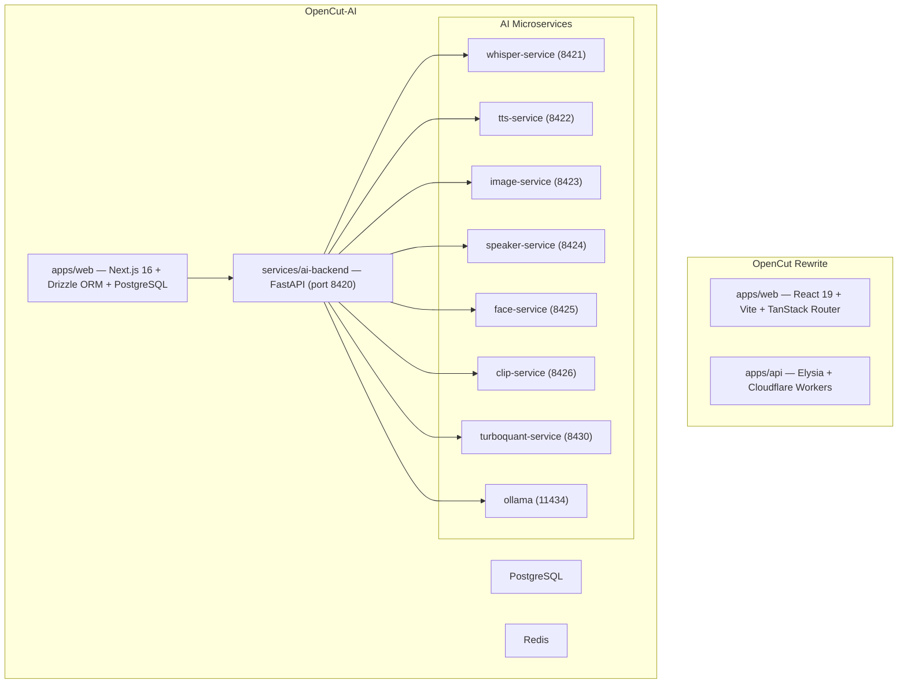

# OpenCut + OpenCut-AI: Integration Plan

## Context

Two codebases that share a common origin but diverged into different products:

- **OpenCut** — rewrite of the video editor from scratch (React 19 + Vite + TanStack Router + Cloudflare Workers)
- **OpenCut-AI** — feature-rich AI video editor (Next.js 16 + FastAPI + Docker Compose with 8 AI microservices)

Both are MIT-licensed. OpenCut-AI started as a fork of the original OpenCut but has since evolved into its own full editor with AI capabilities. The current OpenCut rewrite has a minimal API and no AI features yet.

## Architecture Overview



## Integration Strategies

### Strategy 1: OpenCut Consumes OpenCut-AI Backend (Recommended Starting Point)

Minimal coupling. The OpenCut web app calls the existing OpenCut-AI backend services.

```
OpenCut Web (Vite) → OpenCut-AI Backend (FastAPI :8420) → AI microservices
```

**What to do:**
- Add `NEXT_PUBLIC_AI_BACKEND_URL`-style config to OpenCut's environment
- Create an `ai-client.ts` in OpenCut to talk to the FastAPI endpoints
- OpenCut API (Cloudflare Worker) can proxy `/api/ai/*` → `localhost:8420/*` in dev
- Reuse OpenCut-AI's Docker Compose for local AI services

**Pros:** Fast to ship, no changes to OpenCut-AI, OpenCut gains all AI features immediately
**Cons:** Two separate Docker stacks in dev, network hop for AI calls

---

### Strategy 2: Unified Docker Compose

Extend OpenCut-AI's existing `docker-compose.yml` to include OpenCut's services.

```yaml
# Add to OpenCut-AI's docker-compose.yml
services:
  opencut-api:
    build: ../OpenCut/apps/api
    ports: ["8787:8787"]

  opencut-web:
    build: ../OpenCut/apps/web
    ports: ["5173:5173"]
    environment:
      - VITE_AI_BACKEND_URL=http://ai-backend:8420
```

**What to do:**
- Create a root `docker-compose.yml` in this repo that references both `OpenCut/` and `OpenCut-AI/`
- Configure OpenCut's Vite dev to point to the AI backend container
- Add a shared Docker network so services can resolve each other by name

**Pros:** Single `docker compose up` runs everything, zero network config
**Cons:** Monolithic compose file, different build tooling (Moon vs Turbo)

---

### Strategy 3: Shared Rust Core

OpenCut plans a Rust core. OpenCut-AI could use it for performance-critical paths.

```
Shared Rust Core
├── Timeline data structures
├── Export pipeline
├── Proxy generation
└── FFmpeg bindings
```

**What to do:**
- OpenCut builds the Rust core first (already in their roadmap)
- Extract into a `packages/rust-core/` with Wasm + native bindings
- OpenCut and OpenCut-AI both consume it as a dependency
- OpenCut-AI replaces its current JS export/FFmpeg logic with the Rust core

**Pros:** Both apps benefit, no duplication, performance gains
**Cons:** Rust core doesn't exist yet, months of work

---

### Strategy 4: Converge into a Single Monorepo (Long-term Vision)

Merge both codebases into one monorepo with shared packages.

```
opencut/
├── apps/
│   ├── web/              # OpenCut web (Vite, React 19)
│   ├── legacy-web/       # OpenCut-AI web (Next.js 16) — transitional
│   └── api/              # Cloudflare Workers API
├── services/
│   ├── ai-backend/       # FastAPI (from OpenCut-AI)
│   ├── whisper-service/
│   ├── tts-service/
│   └── ...               # Other AI microservices
├── packages/
│   ├── editor-core/      # Shared editor logic
│   ├── ui/               # Shared component library
│   └── env/              # Shared env schemas
└── docker-compose.yml
```

**What to do:**
1. Extract shared editor logic (timeline, commands, actions) into `packages/editor-core`
2. Extract shared UI components into `packages/ui`
3. OpenCut-AI web becomes `apps/legacy-web`; new features go into `apps/web`
4. Unify package manager (both already use Bun) and build tooling
5. Single `docker-compose.yml` for all services

**Pros:** No duplication, single dev experience, shared types
**Cons:** Massive effort, needs alignment on tech stack (Next.js vs Vite, Turbo vs Moon)

---

### Strategy 5: Hybrid — OpenCut Web + OpenCut-AI Backend as Default Stack

The pragmatic middle ground: OpenCut becomes the frontend, OpenCut-AI becomes the backend.

```
User → OpenCut Web (Vite) → OpenCut-AI Backend (FastAPI) → AI microservices
                         ↘ OpenCut API (CF Workers) → Cloudflare services
```

**What to do:**
1. OpenCut web becomes the primary UI (lighter, faster, modern stack)
2. OpenCut-AI's AI backend + microservices become the standard AI layer
3. OpenCut-AI's Next.js editor is kept for legacy/transition
4. OpenCut API handles non-AI concerns (auth, projects, storage)
5. AI backend handles all AI workloads

**Pros:** Clear separation of concerns, each project does what it does best
**Cons:** Two frontends to maintain during transition

## API Surface: OpenCut → OpenCut-AI Backend

If OpenCut calls the OpenCut-AI backend directly, these are the key endpoints:

| Endpoint | Method | Purpose |
|---|---|---|
| `/health` | GET | Health check + service status |
| `/services/health` | GET | Detailed per-service health |
| `/api/transcribe` | POST | Whisper transcription |
| `/api/transcribe/ws` | WebSocket | Real-time transcription |
| `/api/tts` | POST | Text-to-speech |
| `/api/generate/image` | POST | AI image generation |
| `/api/generate/video` | POST | AI video generation |
| `/api/analyze/smart-cut` | POST | Filler word removal |
| `/api/analyze/scenes` | POST | Scene detection |
| `/api/command` | POST | Natural language command |
| `/api/engagement/score` | POST | Virality scoring |
| `/api/engagement/hooks` | POST | A/B hook testing |
| `/api/reframe` | POST | Smart reframe (face tracking) |
| `/api/llm/chat` | POST | LLM chat (Ollama/TurboQuant) |

## Recommended Phased Roadmap

### Phase 1 — Quick Integration (1-2 weeks)
- Add AI backend URL config to OpenCut
- Create thin `ai-client.ts` wrapper in OpenCut
- Proxy AI calls through OpenCut API in dev
- Document how to run both stacks side by side

### Phase 2 — Unified Docker (1 week)
- Create root `docker-compose.yml` with both projects
- Single `docker compose up` experience
- Shared Docker network for service discovery

### Phase 3 — Shared Packages (2-3 months)
- Extract editor-core shared types + logic
- Extract UI primitives
- Move OpenCut-AI onto shared packages where possible

### Phase 4 — Rust Core & Convergence (6+ months)
- Build shared Rust core in OpenCut
- Port OpenCut-AI's heavy processing to Rust core
- Evaluate merging web frontends

## Quick Start: Running Both Together

```bash
# Terminal 1: Start OpenCut-AI stack (AI services + DB)
cd OpenCut-AI
docker compose up -d

# Terminal 2: Start OpenCut web + API
cd OpenCut
bun install
moon run web:dev   # localhost:5173
moon run api:dev   # localhost:8787
```

OpenCut's web app can then call `http://localhost:8420` for AI features.

## Key Contacts / Origins

| Project | Origin | Upstream |
|---|---|---|
| OpenCut | [opencut-app/opencut](https://github.com/opencut-app/opencut) | MIT |
| OpenCut-AI | [Ekaanth/OpenCut-AI](https://github.com/Ekaanth/OpenCut-AI) | Fork of OpenCut |

## License

Both projects are MIT. No licensing conflicts.
